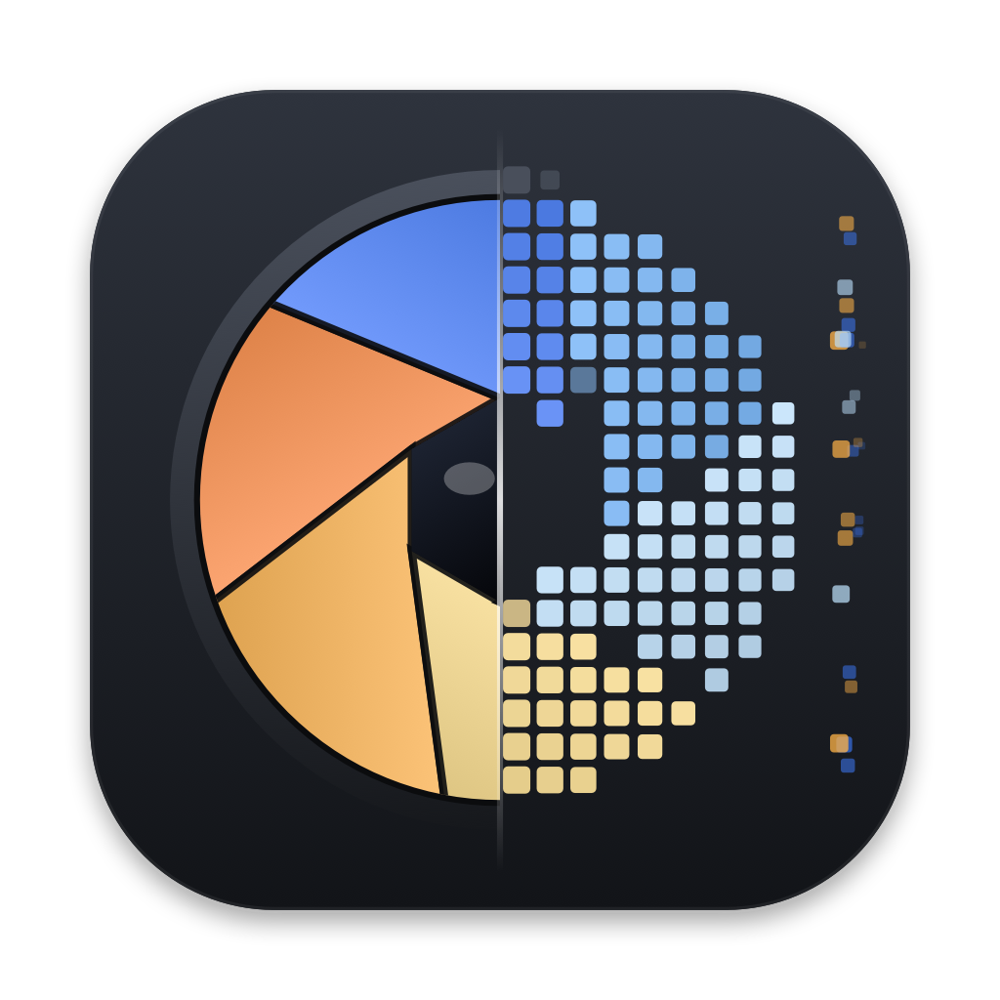

<p align="center"></p>

<h1 align="center">S-Log MetaRaw</h1>
<p align="center"><b>Sony camera metadata and Camera Raw-style controls for DaVinci Resolve 21</b><br>
Ivan Mazzone + Claude · <a href="https://github.com/ivan-94m">github.com/ivan-94m</a> · <a href="https://instagram.com/ivan_94m">@ivan_94m</a></p>

<p align="center">
<b>English</b> · <a href="README.it.md">Italiano</a> · <a href="README.zh.md">简体中文</a> · <a href="README.es.md">Español</a> · <a href="README.pt.md">Português</a>
</p>

---

## The idea

Your Sony camera already recorded how the shot was set up: white balance in Kelvin, tint, EI, lens, shutter, colour
profile. On the MXF files of an FX6, Resolve uses that information and opens a **Camera Raw › Sony Video** panel. On the
MP4 files of an FX30, FX3 or a6300 the same information is in the file — and Resolve ignores it.

S-Log MetaRaw reads it and puts it back to work, so white balance, exposure and colour space start from what the camera
recorded rather than from a guess. Nothing is transcoded and no original file is ever written to.

It is not raw. A log MP4 is a developed, compressed image, and no plugin can undo that. What it can do is repeat the
decisions taken at the camera — the ones raw would let you revisit — on the image that was actually recorded, in linear
light and with published colour science.

| | |
|---|---|
| **Script** (Workspace › Scripts) | Reads the metadata of **every clip in the project at once**, or just the selected ones, and writes it into the Media Pool: Metadata panel, columns, keywords for smart bins, data burn-in, CSV export. It shows everything it read, grouped the way Catalyst Browse groups it, and it repairs fields Resolve fills in wrong on MXF — such as *Camera Aperture* reading `F53343` on the FX6. |
| **Plugin** (OpenFX, Color page) | One clip, handled as if the Raw panel were there: Color Temp, Tint, Exposure (EI), White Balance, Color Space/Gamma and tone. It **configures itself** from that clip's as-shot values, and at those values it is neutral: it changes nothing until you move something. |

---

## Install

1. Download `SLogMetaRaw-x.y.z.dmg` from the **Releases** page and open it.
2. Double-click **Installa S-Log MetaRaw.pkg**. The installer is not signed with an Apple certificate, so the first time
   you have to right-click it and choose **Open**.
3. Restart DaVinci Resolve.

The installer places exactly three things:

| Path | What |
|---|---|
| `/Library/OFX/Plugins/SLogMetaRaw.ofx.bundle` | the OpenFX node |
| `/Library/Application Support/SLogMetaRaw/lib/slogmetaraw` | the Python library (the parsers) |
| `…/Blackmagic Design/DaVinci Resolve/Fusion/Scripts/Utility/S-Log MetaRaw.py` | the menu entry for the script |

While it runs it also writes one small JSON file per clip in `~/Library/Application Support/SLogMetaRaw/cache`, and CSV
exports go to `~/Documents/SLogMetaRaw`. **Disinstalla S-Log MetaRaw.command**, on the disk image, removes all of it. The
disk image also carries the one-page guides, **S-Log MetaRaw Guide (english).pdf** and
**Guida S-Log MetaRaw (italiano).pdf**.

**Requirements:** macOS 12 or later (Apple Silicon or Intel) and DaVinci Resolve 21. **Tested only on Resolve Studio 21.1
on macOS.** Earlier versions are untested: the script may work if you have Python 3 installed (Resolve ships its own
interpreter only from 21.1), while the plugin relies on features introduced with Resolve 21 — OpenFX 1.5 colour
management above all — so there you would have to set *Avanzate › Ingresso nodo* (Advanced › Node input) by hand.

**Supported clips:** Sony XAVC, `.MP4` or `.MXF`, recorded in **S-Log2 or S-Log3**. The profiles the node develops are
`S-Gamut3.Cine/S-Log3`, `S-Gamut3/S-Log3`, `S-Gamut/S-Log2` and `S-Gamut/S-Log`. The script reads the metadata of any
Sony XAVC clip, log or not; the node stays neutral on anything else.

---

## Guide

### 1 · The script

**Workspace › Scripts › S-Log MetaRaw.** The window has three buttons, in the order you use them.

- **Origine** (source) — *Clip selezionate nel Media Pool* (selected clips), *Bin corrente (con sottocartelle)* (current
  bin, subfolders included) or *Tutto il Media Pool* (the whole Media Pool).
- **1 · Leggi metadata** — reads the clips. Nothing is written yet. The table fills with one row per clip: Clip, Camera,
  lens, focal length, aperture, shutter, ISO/EI, WB, colour space, data level, and a *Stato* (status) column that says
  `letto` (read), or `letto · varia: diaframma, fuoco` when a value changed during the take, or why a clip was skipped.
  **Click a row** and the lower panel shows everything that was read, in the same sections Catalyst Browse uses.
- **2 · Scrivi in Resolve** — writes the metadata into the Media Pool.
- **Esporta CSV (campi custom)** — writes a CSV to `~/Documents/SLogMetaRaw` for the values Resolve has no field for
  (see below).

Two checkboxes:

- **Sovrascrivi i campi già compilati** (overwrite fields that already have a value), on by default. This is what repairs
  the wrong values Resolve writes by itself, such as *Camera Aperture* `F53343` on FX6 MXF. Turn it off and only empty
  fields are filled.
- **Imposta anche Input Color Space (RCM) dai metadata** (also set Input Color Space from the metadata), off by default.
  Useful in a colour-managed project, but be aware: once set from a script, the value cannot be put back to *Project*
  by a script — only by hand, in Resolve.

Your original files are never modified: the script only reads them.

### 2 · The node

**Color page › OpenFX › S-Log MetaRaw**, as the **first node**, before any CST or LUT. It shows the camera at the top and
sets Color Temp, Tint and Exposure to the as-shot values. At those values it does nothing to the image — it is a starting
point, not a look. Copy the node onto another clip and it reconfigures itself with that clip's data.

| Control | Range | Default | What it does |
|---|---|---|---|
| **Rileggi metadata** | — | — | re-reads the clip and returns every control to the camera values |
| **Decode Using** | Camera metadata / Clip | Clip | *Camera metadata* pins everything to the as-shot values and greys the controls out; *Clip* lets you change them |
| **White Balance** | As shot · Daylight 5600 K · Cloudy 6500 K · Shade 7500 K · Tungsten 3200 K · Fluorescent 4000 K · Flash 5500 K · Custom | As shot | presets; moving a slider switches it to *Custom* |
| **Color Temp** | 2000–15000 K | as shot | chromatic adaptation in linear light |
| **Tint** | −100 … +100 | as shot | green/magenta, perpendicular to the Planckian locus |
| **Exposure** | 25–409600 EI (slider 50–25600) | as shot | exposure index: double the EI is +1 stop |
| **Color Space** | Timeline · DaVinci WG · Rec.709 · Rec.2020 · P3 D65 · P3 D60 · P3 DCI · S-Gamut · S-Gamut3 · S-Gamut3.Cine · ACES AP0 · ACES AP1 | Timeline | output gamut, like a Color Space Transform. *Timeline* does not convert |
| **Gamma** | Timeline · DaVinci Intermediate · Linear · Gamma 2.2 · Gamma 2.4 · Gamma 2.6 · Rec.709 · sRGB · SLog · SLog2 · SLog3 · ACEScct | Timeline | output curve. *Timeline* does not convert |
| **Toni:** Shadows, Highlights, Color Boost, Saturation, Contrast | −1 … +1 | 0 | tone and colour trims |
| **Avanzate › Ingresso nodo** | Automatico · DaVinci WG/Intermediate · S-Gamut3.Cine/S-Log3 · S-Gamut3/S-Log3 · S-Gamut/S-Log2 · ACES AP1/ACEScct | Automatico | the colour space entering the node. *Automatico* asks Resolve; change it only if what Resolve reports is wrong |
| **Avanzate › Rilevato / Stato** | — | — | what was detected, and whether the metadata was found |
| **Dati di ripresa** | — | — | read-only: lens, focal length, aperture, focus, shutter, ISO/EI, white balance, colour, frame rate, ND/stabiliser, camera LUT, file |

The node keeps its settings per clip: they are saved with the grade and restored when you come back to that clip. They
reset only for a different clip, or when you press *Rileggi metadata*.

### 3 · A working order

1. Import the footage, run the script, press **1** then **2**.
2. On the Color page put **S-Log MetaRaw** first, leave *Color Space* and *Gamma* on *Timeline* in a colour-managed
   project, and let your usual CST or LUT follow.
3. Correct white balance and exposure **in the node** rather than with lift/gamma/gain: there the move happens in linear
   light, before any curve, which is where a camera would have made it.

---

## What gets written into Resolve

**Standard fields**, filled only when the clip actually contains the value:

`Camera Manufacturer` · `Camera Type` · `Camera TC Type` · `Camera Serial #` · `Camera Firmware` · `Camera FPS` ·
`Shutter Type` · `Shutter Angle` · `Shutter Speed` · `Exposure Mode` · `ISO` · `White Point (Kelvin)` ·
`White Balance Tint` · `Mon Color Space` · `Monitor LUT` · `LUT Used` · `Lens Type` · `Lens Number` · `Lens Notes` ·
`Camera Aperture Type` · `Camera Aperture` · `Focal Point (mm)` · `Distance` · `ND Filter` · `Codec Bitrate` ·
`Sensor Area Captured` · `PAR Notes` · `Aspect Ratio Notes` · `Gamma Notes` · `Color Space Notes` · `Date Recorded`

**Camera Notes** gets a readable summary, **Keywords** gets camera model, gamma, colour primaries and `S&Q` when the clip
was shot in slow or fast motion — those make smart bins work. Everything that was read, including the values with no
standard field, is also attached as third-party metadata under the `SLogMetaRaw.` prefix.

**Input Color Space** (only if you tick the box) is mapped like this:

| In the clip | Set in Resolve |
|---|---|
| S-Gamut3.Cine/S-Log3 · S-Gamut3/S-Log3 · S-Gamut/S-Log2 · S-Gamut/S-Log | the same name |
| ITU-R BT.2100 HLG · HLG Live · HLG Mild | Rec.2100 HLG |
| S-Cinetone · ITU-R BT.709-5 | Rec.709 (Scene) |

**CSV export** covers what Resolve has no field for: EI, ISO, gain, WB mode, lighting preset, tint, AE mode, AF area,
35 mm-equivalent focal length, focus distance, colour space, capture gamma, luminance code range, codec range,
stabiliser, monitoring LUT, recording mode, capture fps, recording time, format. The file is written in Resolve's own
metadata CSV format (UTF-16); import it with **File › Import › Metadata**, with *create custom fields* enabled.

---

## How it works

### Where the data is, and how little of the file is read

In Sony XAVC files the acquisition data is recorded **frame by frame**:

- in **MP4**, in the `rtmd` timed-metadata track;
- in **MXF**, in SMPTE ST 436 ANC packets (DID 0x43 / SDID 0x05).

Both are KLV structures holding the **SMPTE RDD 18** acquisition sets, plus Sony's own tags. Alongside them sits the
*NonRealTimeMeta* XML — the `M01.XML` sidecar, or an embedded copy — with model, serial, firmware, capture gamma and
colour primaries, and the H.264/HEVC **SPS**, which gives profile, bit depth and full/limited range.

The parser reads the file index and samples the metadata track **once per second, up to 120 samples**. That is how the
*Stato* column can say that aperture or focus changed during the take, and it is why a multi-gigabyte clip costs about
**100 KB of reading**: nothing is decoded, no frame is rendered.

Written in pure Python, no external dependencies, no ExifTool, nothing to install besides the package itself.

### From the script to the node

The script uses the Resolve 21.1 scripting API (Resolve ships Python 3.14). Besides the Media Pool fields, each clip gets
a flat JSON record in `~/Library/Application Support/SLogMetaRaw/cache`, named after a hash of the clip path.

The node learns which file the clip is through Resolve's `kOfxImageEffectPropSrcFilePath` extension, and reads that
record — that is how it configures itself. If the record is missing it generates it by running
`ResolvePython -m slogmetaraw --cache` on the clip. That reader runs on the interface thread, so it is kept on a leash:
at most 8 seconds, one attempt per clip, and files that are only a cloud placeholder on disk are skipped rather than
downloaded. The node's working colour space comes from Resolve through OpenFX 1.5 colour management.

### The colour maths

Everything happens in **linear light**, in the gamut entering the node, in this order:

1. **Decode** the incoming curve and multiply by the exposure ratio `chosen EI / as-shot EI` — doubling EI is exactly one
   stop.
2. **White balance**: von Kries adaptation in **Bradford LMS**, from the as-shot white to the chosen white. Both whites
   come from the **Planckian locus** (Kim et al. 2002 cubic approximation, valid 1667–25000 K); *Tint* moves the white
   perpendicular to the locus in the CIE 1960 *uv* plane. The result is normalised so the move does not change the
   luminance of D65.
3. **Tone**: `Shadows`, `Highlights` and `Contrast` act on log2 luminance around 18% grey, with the shadow and highlight
   weights fading out over five stops, so they stay where they belong instead of tilting the whole image.
4. **Saturation and Color Boost**: a scaling around luminance; Color Boost is a vibrance, weighted by how saturated each
   pixel already is, so it lifts the muted colours and leaves the strong ones alone.
5. **Color Space / Gamma**: if either differs from the node's space, a conversion through XYZ, exactly like a Color Space
   Transform; otherwise the image is re-encoded in the curve it came in with.

Transfer functions follow the published definitions: **S-Log, S-Log2 and S-Log3** from the Sony papers, **DaVinci
Intermediate**, **ACEScct**, **Rec.709** (BT.709 OETF), **sRGB**, and pure gammas 2.2 / 2.4 / 2.6. Gamut matrices, with
their inverses, cover DaVinci Wide Gamut, Rec.709, Rec.2020, P3 D65/D60/DCI, S-Gamut, S-Gamut3, S-Gamut3.Cine, ACES AP0
and AP1 (S-Gamut3 shares S-Gamut's primaries, as Sony documents).

The maths lives in one file, `DevelopMath.h`, generated by `tools/build_math.py` and compiled **both** as C++ and as the
**Metal** kernel, so the GPU and CPU paths cannot drift apart. Rendering runs on Metal, with a CPU fallback.

Where the camera did not record a colour temperature — the a6300 among others — the value is derived from the lighting
preset the camera did record (Daylight 5600 K, Cloudy 6500 K, Shade 7500 K, Incandescent 3200 K, Fluorescent 4000 K,
otherwise 5600 K) and the node flags it as estimated, in the status line and in the shooting data.

### What has been checked

- **Field by field against Catalyst Browse** on FX6, FX30 and a6300: labels and values.
- **Three implementations agree.** The Python reference model, the C++ code and the Metal kernel match to within
  **2·10⁻⁴** over a random sweep of parameters and colour spaces.
- **Inside Resolve**: LUTs exported from the node were compared against the same model, error below **0.0003**.
- **A miniature OpenFX host** (`tests/host_test.cpp`) loads the built plugin and runs what Resolve runs — load, describe,
  both contexts, building a node on a real clip — so a crash in the node panel shows up here instead of in Resolve.
- 25 automated tests in total: parsers, develop model, C++, Metal, OpenFX host, plugin parameters.

---

## Building from source

```bash
make -C ofx/SLogMetaRaw                     # universal arm64 + x86_64 plugin (needs Xcode)
./install.sh --dev                          # installs script and plugin pointing at this folder
python3 -m unittest discover -s tests       # the 25 tests
./packaging/build_installer.sh              # builds dist/SLogMetaRaw-x.y.z.dmg
python3 -m slogmetaraw folder_or_file       # Catalyst-style view from the command line
python3 -m slogmetaraw --cache clip.MP4     # writes only the JSON record the node reads
```

```
slogmetaraw/         mp4, mxf, rtmd, nrt, codec parsers · Resolve writing · the script window
resolve_script/      launcher for Workspace › Scripts
ofx/SLogMetaRaw/     OpenFX plugin (C++, Metal); DevelopMath.h is generated by tools/build_math.py
tools/               gamut matrices, generators, icons
tests/               tests (the sample clips are not in the repository)
packaging/           installer: package, PDF guide, uninstaller
```

---

## Known limits

- Resolve's **real** Camera Raw panel and its **gyro stabilisation** cannot be unlocked for MP4: both depend on Resolve's
  internal decoder (Sony only for MXF, gyro only for Blackmagic cameras). S-Log MetaRaw is the equivalent for the colour
  controls, not a way in.
- It needs **S-Log2 or S-Log3**. With any other profile the node stays neutral and says so.
- Some cameras do not record the colour temperature: it is estimated from the lighting preset and flagged.
- **S-Log2:** the formula follows the Sony paper (18% grey at code 347). The S-Log2 curve that ships with Resolve differs
  by about 0.15 stop, so the two do not land in exactly the same place.
- Still to be validated on more files: XAVC HS (HEVC), HLG and S-Cinetone, powered zooms, GPS.
- **An independent hobby project**, distributed as is, with no warranty and no liability for professional use. The code is
  open: anyone can read it, test it and change it.

---

## Credits

**Ivan Mazzone + Claude** — [github.com/ivan-94m](https://github.com/ivan-94m) · [@ivan_94m](https://instagram.com/ivan_94m).

Written together with **Claude Opus 5** (Anthropic): version 1.0 is dated 19 September 2026, 1.0.1 the day after.

References for the Sony tags: SMPTE RDD 18, [ExifTool](https://exiftool.org) (Sony.pm) and
[telemetry-parser](https://github.com/AdrianEddy/telemetry-parser) by AdrianEddy (MIT). Part of the tag table comes from
the latter.

Sony, XAVC and Catalyst are trademarks of Sony Group Corporation; DaVinci Resolve is a trademark of Blackmagic Design.
This is an independent project, not affiliated with or endorsed by either company.

## Licence

[GNU General Public License v3.0 or later](LICENSE). Free software: you may use, study, modify and redistribute it;
anyone who redistributes it, modified or not, must do so under the same licence and make the source code available. No
warranty of any kind.

The OpenFX SDK belongs to The Open Effects Association (3-clause BSD) and part of the Sony tag table comes from
telemetry-parser (MIT): both compatible with the GPL-3.
