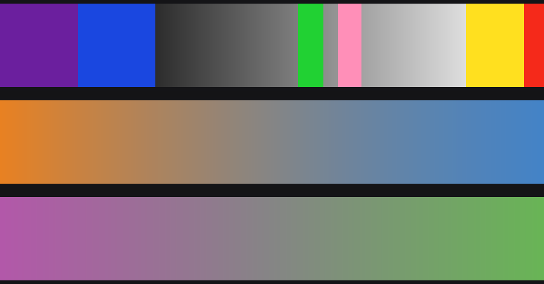

# False color: come lo fa CineMatch, come lo fa S-Log MetaRaw

Ricerca alla base dei tre toggle *False color* del nodo e dello stadio `sm_false_color`
(`ofx/SLogMetaRaw/math/FalseColor.h`). Le affermazioni su CineMatch vengono dal **binario installato**
(`/Library/OFX/Plugins/CineMatch.ofx.bundle`) e dalle sue risorse, non dalla
documentazione: dove la documentazione conferma, è citata.



---

## 1 · CineMatch ha esattamente questa cosa, e sono quattro

Nel binario, nella tabella delle etichette:

```
Exposure False Colors          Exposure False Color Choices
White Balance False Colors     WB False Color Choices
White Balance Picker
```

e fra i simboli dei kernel GPU:

```
apply_middle_grey_false_color   apply_skin_tone_false_color
apply_temperature_false_color   apply_tint_false_color
```

più quattro LUT 64³ dedicate in `/Library/Application Support/CineMatch/Resources/ViewLUTs/`:
`ExpMidGreyFalseColor709.tin`, `ExpSkintoneFalseColor709.tin`, `WBTempHelperLUT.tin`,
`WBTintHelperLUT.tin`.

Sono **due viste di esposizione** (grigio medio, incarnato) e **due di bilanciamento**
(temperatura, tinta), messe nel gruppo `primariesgroup` **accanto agli slider che
servono a regolare** — Exposure, Temp, Tint. Esattamente l'idea da cui parte la tua
richiesta. CineMatch non ha invece zebra, indicatore di clipping, waveform, scope,
lettura IRE né riconoscimento di chart: quelle stringhe nel binario non esistono.

Il workflow che FilmConvert documenta:

> "Green is mapped to the middle grey range for REC.709."
> "This False Color view maps orange to a common exposure for skin tones in REC.709."
> "All warm elements are mapped to orange and all cool elements are mapped to blue."
> "Identify a part of your image that you would like to be neutral and move the
> temperature slider until that area is grey."

— [CineMatch Resolve Workflow Guide](https://www.filmconvert.com/blog/cinematch-resolve-workflow-guide/)

### Le soglie esatte dei suoi kernel

**Grigio medio** — un colore solo, RGB(157, 216, 0), su `|log2(Y/0.18)| < 0.40` stop,
con rampa lineare da 1.0 sul grigio a 0.0 a ±0.40. Fuori dalla banda l'immagine resta
monocromatica.

**Incarnato** — un colore solo, RGB(250, 124, 8), da 0 a +2 stop sopra il grigio, con
spline vincolata: plateau pieno fra +0.5 e +1.5 stop.

**Temperatura e tinta** — e qui sta la differenza che conta:

```c
float4 hsl = rgb_to_hsl(clamp(v, 0.0f, 1.0f));
float normalized_hue = hsl.x > 0.9f ? hsl.x - 1.0f : hsl.x;
...
if (in warm band) hsl.x = 0.08f; else hsl.x = 0.586f;
v = hsl_to_rgb(hsl);
v = saturate(v, remap(hsl.y, 0.0f, 1.0f, 8.0f, 1.0f));
```

| Vista | Banda | Tinta HSL | Gradi | Forzata a |
|---|---|---|---|---|
| Temperatura | caldo | −0.025 … 0.160 | −9° … 58° | 29° (arancio) |
| Temperatura | freddo | 0.50 … 0.75 | 180° … 270° | 211° (blu) |
| Tinta | verde | 0.20 … 0.45 | 72° … 162° | 108° (verde) |
| Tinta | magenta | 0.80 … 0.95 | 288° … 342° | 306° (magenta) |

**CineMatch non calcola una temperatura di colore.** Desatura il fotogramma, classifica
ogni pixel **per tinta HSL**, forza le tinte in banda a un valore canonico e alza la
saturazione fino a **8×** sui pixel quasi neutri (`remap(hsl.y, 0,1, 8,1)`: più il pixel
è neutro, più viene esaltato). I neutri cadono fra le due bande e restano grigi — ed è
questo che fa funzionare il "regola finché non diventa grigio".

È una **mappa di classificazione per tinta**, non una mappa colorimetrica. Funziona ed è
robusta, ma non può dirti *di quanto* sei fuori.

---

## 2 · Il riferimento: ARRI ALEXA

La convenzione canonica, dall'ARRI ALEXA Pocket Manual:

| Colore | Livello segnale | Significato |
|---|---|---|
| Rosso | 99–100% | clipping del bianco |
| Giallo | 97–99% | appena sotto il clipping |
| Rosa | 52–56% | **una fermata sopra il grigio medio** (incarnato caucasico) |
| Verde | 38–42% | grigio neutro 18% |
| Blu | 2,5–4,0% | appena sopra il clipping del nero |
| Viola | 0–2,5% | clipping del nero |

Il resto resta monocromatico: solo ~14 IRE su 100 sono colorati. È una scelta di
progetto, non una limitazione — bande strette su àncore che contano, e l'immagine
ancora leggibile intorno. Leeming LUT Pro dichiara gli stessi bersagli in altra forma:
grigio 18% a 42 IRE, incarnato fra 70 e 75 IRE.

Nota: il rosa di ARRI significa letteralmente "una fermata sopra il grigio medio", non
"incarnato" in senso stretto.

---

## 3 · Perché l'icona non può stare a sinistra dello slider

Verificato sull'SDK che Resolve distribuisce
(`/Library/Application Support/Blackmagic Design/DaVinci Resolve/Developer/OpenFX/`):

- **`kOfxParamPropLayoutHint` non esiste.** Né `NoNewLine`, né `setLayoutHint`, né
  `kOfxParamPropLayoutPadWidth`. Cercando `Layout` in tutto l'SDK si trovano due sole
  occorrenze, entrambe in un rimando di documentazione senza rapporto.
  Il motivo: quella proprietà **non fa parte di OpenFX**, è un'estensione Foundry/Nuke
  dichiarata in `fnPublicOfxExtensions.h`, che Resolve non distribuisce.
- Resolve dichiara `pageRowCount=0` e `pageColumnCount=0`: non implementa nemmeno il
  meccanismo di layout a griglia previsto da OpenFX. Impagina i parametri come una pila
  verticale di righe etichettate.
- `supportsCustomInteract=0`: un plugin non può disegnarsi un widget nel pannello.

Quindi **ogni parametro occupa una riga intera, e non c'è modo di affiancarne due.**
Non è una scelta: è il limite dell'host.

Cosa invece esiste: `kOfxPropIcon` e il metodo `ParamDescriptor::setIcon(nome, pngFormat)`,
sulla classe base di *tutti* i tipi di parametro. La documentazione OpenFX è però
permissiva — *"Some applications are able to display icons instead of text"* — e **non è
documentato da nessuna parte se Resolve le disegni davvero**. Indizio contrario: CineMatch,
plugin commerciale con un pannello complesso, spedisce **una sola** immagine (la miniatura
160×90 dell'effetto) e nessuna icona, e chiama i suoi pulsanti a parole, incluso
`Reset On Screen Control` — proprio il tipo di comando che sarebbe stato un'icona se si
fosse potuto.

**Cosa fa S-Log MetaRaw**: chiama `setIcon` con le tre icone (sono nel bundle, in
`Contents/Resources/`), e mette ogni toggle **immediatamente sopra lo slider che serve**.
Se Resolve disegna l'icona, si vede l'icona; se la ignora, resta l'etichetta, che dice la
stessa cosa. È esattamente la struttura di CineMatch — booleana + menu sopra lo slider —
arrivata per la stessa strada.

---

## 4 · Cosa fa S-Log MetaRaw, e in cosa differisce

Tre viste, una per controllo, mutuamente esclusive.

### Esposizione

Bande in **fermate attorno al grigio 18%**, secondo la struttura ARRI:

| Colore | Fermate | Significato |
|---|---|---|
| Rosso | ≥ +5,5 | clip |
| Giallo | +4,0 … +5,5 | vicino al clip |
| Rosa | +0,70 … +1,30 | una fermata sopra il grigio (incarnato) |
| Verde | −0,33 … +0,33 | grigio 18% |
| Blu | −6,0 … −4,0 | ombra profonda |
| Viola | ≤ −6,0 | clip del nero |
| Grigi | il resto | l'immagine resta leggibile |

Le fermate sono misurate sulla **luminanza lineare**, non sul segnale codificato: sono
quindi indipendenti dalla curva log della clip, e la lettura non cambia passando da
S-Log2 a S-Log3 o da una timeline all'altra.

### Temperatura e tinta — come CineMatch, sull'asse giusto

Dalla 2.0 le due viste **si comportano come quelle di CineMatch**: l'immagine diventa grigia,
le dominanti si colorano con le sue quattro tinte canoniche e i quasi-neutri vengono esaltati
fino a 8×. Si regola come là: **muovi lo slider finché ciò che deve essere neutro resta grigio.**

| Vista | Dominante | Colore (HSL come CineMatch) | Cosa fare |
|---|---|---|---|
| Temperatura | fredda | blu, 211° | alza *Color Temp* |
| Temperatura | calda | arancio, 29° | abbassa *Color Temp* |
| Tinta | verde | verde, 108° | alza *Tint* |
| Tinta | magenta | magenta, 306° | abbassa *Tint* |

Per ogni pixel:

1. **Saturazione mostrata** = saturazione HSL del pixel codificato per il display (gamma 2,2,
   normalizzata, quindi indipendente dall'esposizione) moltiplicata per `8 − 7·s`: 8× vicino
   al neutro, 1× sui colori pieni. È il `saturate(v, remap(s, 0, 1, 8, 1))` di CineMatch.
2. **Luminosità** = il grigio della vista, che sale con gli stop: la scena resta leggibile.
3. **Asse**: qui sta l'unica differenza. CineMatch decide per *tinta HSL* (un pixel è "caldo" se
   la sua tinta cade fra −9° e 58°). S-Log MetaRaw misura la deviazione dal bianco in
   **CIE 1960 uv** e la proietta sull'inverso della **risposta reale dei due slider**, misurata
   al valore corrente:

   ```
   neutralUV(k, t, k,       t)      dove sta il neutro adesso
   neutralUV(k, t, k + 100, t)      dove va con +100 K di slider
   neutralUV(k, t, k,   t + 5)      dove va con +5 di tint
   ```

   Il pixel si colora nella vista della temperatura se la sua dominante pesa più in Kelvin
   che in tint, e viceversa. Così **ogni vista risponde solo al suo slider**: una dominante
   verde lascia grigia la vista della temperatura, invece di finire in una banda "calda" o
   "fredda" a seconda della tinta HSL. Un errore di sola tinta di 20 unità sbava di meno di
   40 K sull'altro asse, anche a 3200 K (verificato in `tests/test_falsecolor.py`).
4. **Pixel che non si possono giudicare**: sotto −6 stop e sopra +5,5 stop il colore sfuma nel
   grigio (rampe di 2 e 1 stop). Lì la tinta è rumore o clipping, non una dominante.

Un errore di 100 K su 5600 K si vede appena, come in CineMatch; 300 K si vedono bene, e il colore
cresce con l'errore. Il numero in Kelvin non si legge dalla vista: la vista dice *da che parte*
muovere lo slider e quando fermarsi.

### Dove sta nella pipeline

Le tre viste sono prese **subito dopo esposizione e bilanciamento, prima dei trim di tono
e saturazione**. Non è un dettaglio: un trim di saturazione scalerebbe la deviazione
cromatica e farebbe **mentire** la lettura in Kelvin, un trim di contrasto sposterebbe le
fermate. Così rispondono solo ai tre controlli a cui appartengono.

La banda viene poi riportata in lineare Rec.709, convertita nel gamut in cui il nodo sta
scrivendo e ricodificata lì, così esce dello stesso colore qualunque cosa faccia la
timeline — DaVinci WG/Intermediate, ACEScct, Rec.709. Verificato in `tests/test_falsecolor.py`.

### Confronto

| | CineMatch | S-Log MetaRaw |
|---|---|---|
| Viste esposizione | 2 (grigio medio, incarnato), un colore ciascuna | 1, sei bande ARRI insieme |
| Viste bilanciamento | 2, immagine grigia, tinte canoniche, quasi-neutri 8× | uguali |
| Come sceglie l'asse | tinta HSL del pixel | deviazione in uv sull'inverso della risposta degli slider |
| Neutro appare | grigio | grigio |
| Dove sta | sopra gli slider, booleana + menu | sopra gli slider, tre booleane con icona |

---

## 5 · Come si usano

1. Metti il nodo per primo, *Decode Using* su **Clip** (le viste servono a regolare i tre
   controlli: in *Camera metadata* quei controlli sono bloccati e il nodo è trasparente).
2. **Esposizione**: accendi la vista, punta il grigio medio o l'incarnato, muovi
   *Exposure* finché la zona giusta diventa verde (grigio 18%) o rosa (una fermata sopra).
3. **Temperatura**: accendi la vista, trova una superficie che deve essere neutra, muovi
   *Color Temp* finché resta grigia (blu: alza, arancio: abbassa).
4. **Tinta**: idem con *Tint* (verde: alza, magenta: abbassa). Un paio di passate alternate e
   converge.
5. Spegni la vista prima di renderizzare.

**Attenzione**: la vista sostituisce l'immagine, non è un overlay — in Resolve un plugin
OpenFX non ha modo di disegnare sopra il viewer nel pannello (gli overlay interact
esistono ma vanno accesi a mano dal menu del viewer e servono a widget trascinabili).
Quindi se la lasci accesa, **renderizzi il false color**. Il campo *Avanzate › Rilevato*
lo scrive a chiare lettere quando una vista è attiva.

---

## 6 · Cosa non è stato possibile stabilire

1. **Se Resolve disegni davvero `kOfxPropIcon` sui parametri.** Nessuna documentazione,
   nessun post, nessun sorgente in un senso o nell'altro; il catalogo di stranezze OFX di
   Resolve tenuto da Natron non ne parla. Si vede aprendo il pannello.
2. **Le etichette del menu esposizione di CineMatch**: non esistono come stringhe nel
   binario (sono inlined), la documentazione le chiama "Middle Grey" e "Skintones".
3. **I nomi interni dei parametri non-gruppo di CineMatch**: ottimizzati come stringhe
   corte e inlined nelle istruzioni; servirebbe disassemblare.
4. **I valori RGB delle bande ARRI**: il PDF ufficiale è una scansione raster senza testo.
   Gli intervalli in percentuale sono confermati, i colori esatti no.
5. **I valori per banda dei preset False Color di ResolveFX**: il manuale documenta i
   controlli, non i numeri.

---

## Fonti

[CineMatch Resolve Workflow Guide](https://www.filmconvert.com/blog/cinematch-resolve-workflow-guide/) ·
[CineMatch Premiere Workflow Guide](https://www.filmconvert.com/blog/cinematch-workflow-guide/) ·
[ARRI ALEXA Pocket Manual, False Color Exposure Check](https://www.manualslib.com/manual/1152031/Arri-Alexa.html?page=37) ·
[ARRI LogC False Color Exposure Zones and Key](https://www.arri.com/resource/blob/390448/2d469ae1e98110562fe347cea50a284b/arri-logc-false-color-specification-data.pdf) ·
[SmallHD Exposure Assist](https://guide.smallhd.com/m/all_monitors/l/808517-exposure-assist-false-color) ·
[Leeming LUT Pro](https://www.leeminglutpro.com/) ·
[MONONODES Utility DCTL](https://mononodes.com/utility-dctl/) ·
[lut_builder](https://github.com/Today20092/lut_builder) ·
[Natron, README-hosts.txt (stranezze OFX di Resolve)](https://github.com/NatronGitHub/openfx-misc/blob/master/README-hosts.txt) ·
[Foundry fnPublicOfxExtensions.h](https://github.com/NatronGitHub/openfx/blob/master/include/nuke/fnPublicOfxExtensions.h) ·
[OpenFX 1.5: Effect Parameters](https://openfx.readthedocs.io/en/main/Reference/ofxParameter.html) ·
SDK OpenFX distribuito con DaVinci Resolve (`ofxCore.h`, `ofxsParam.h`) ·
binario e risorse di CineMatch 1.35 installato
