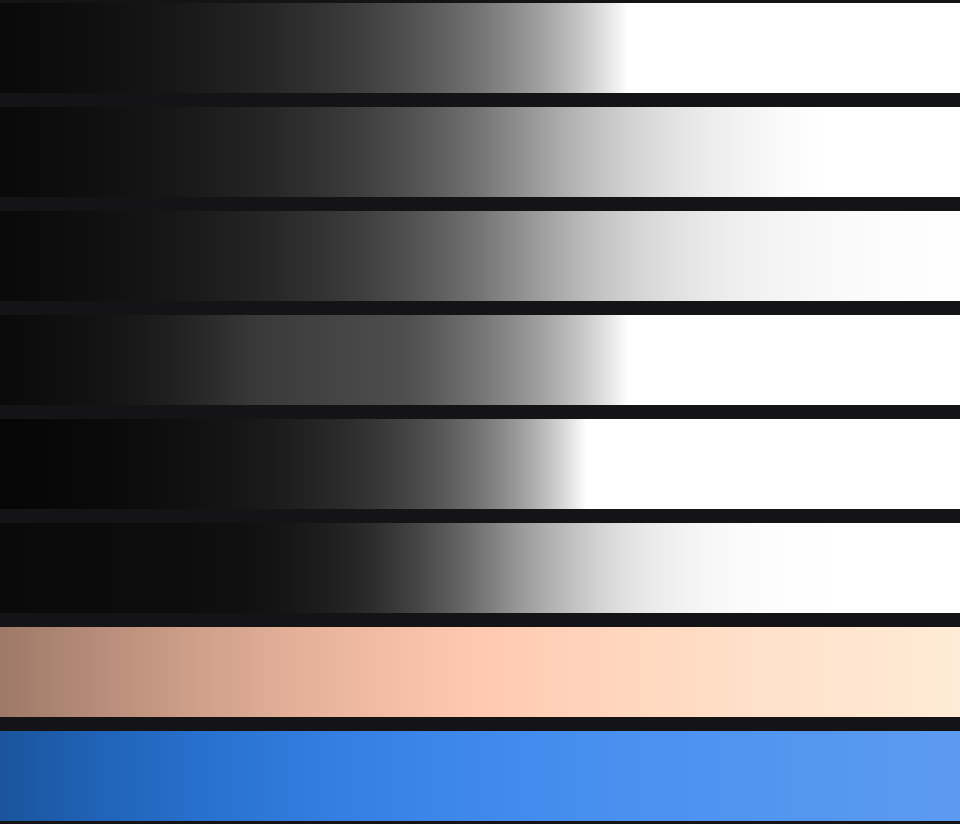

# La pressa, il piede e il colore: come sono fatti Highlights e Shadows

Ricerca alla base dello stadio `sm_tone` di `DevelopMath.h`. Le misure vengono dai
LUT installati su questa macchina; le formule di riferimento dal codice sorgente di
OpenDRT, dalla documentazione ACES 2.0 e dal sorgente di darktable. Dove non sono
riuscito a stabilire qualcosa, è scritto in fondo.



---

## 1 · Due operatori, due difetti, entrambi misurati

### 1.1 · Il gradino (fino alla v1.0)

L'operatore originale era un **gradino, non una spalla**:

```
ev_out = ev + highlights · 2 · clamp(ev/5, 0, 1)²
```

| ev in | pendenza | cosa succede |
|---|---|---|
| +1 | 0,840 | comprime |
| +3 | 0,520 | comprime |
| +4,9 | 0,216 | comprime molto |
| **+5,0** | **salta a 1,000** | **smette del tutto** |
| +8 | 1,000 | nessuna compressione, solo un offset fisso |

Tre difetti, tutti misurati:

1. **Sopra +5 stop la pendenza torna esattamente a 1.** Non è una spalla: abbassa il
   tetto di 2 stop e continua a clippare, solo più tardi.
2. **Salto di pendenza da 0,202 a 1,000 in un punto.** In un cielo i pixel che valgono
   esattamente +5 stop formano una curva di livello, e attorno a una sorgente
   luminosa quelle curve sono concentriche: **un anello**, che si legge come un alone
   pur essendo l'operatore puntuale.
3. **Recupera 0,9 stop.** Porta il clip di un Rec.709 da +2,47 a +3,40 stop sopra il
   grigio. Una S-Log3 ne porta 7,7: se ne buttavano via quasi sette.

### 1.2 · Rapporti più purezza (v1.1.0): **l'immagine si invertiva**

La v1.1.0 ha sostituito il gradino con una spalla soft-clip corretta, applicata come
un fattore unico sui tre canali, più un termine di purezza che tirava il pixel verso
la luminanza:

```
t      = spalla(norm) / norm
rgb'   = rgb · t
purezza = t ^ k(t)                    k(t) = 0,5 · (1 + max(1 − t, 0))
rgb''  = y + (rgb' − y) · purezza
```

La spalla, da sola, è monotona e va benissimo. **Il difetto è la coppia.** Quando
`spalla(norm)` raggiunge il suo asintoto è piatta, mentre `purezza` continua a
scendere senza limite (`t → 0 ⇒ purezza → 0`). Il canale in uscita vale

```
out = spalla(norm) · ( y₀ + (b₀ − y₀) · purezza(t) )
```

e con il primo fattore piatto e il secondo che scende, **il prodotto scende**: un
pixel cromatico più luminoso esce più scuro. Misurato su una rampa blu satura:

| Highlights | inverte sopra | in stop dal grigio |
|---|---|---|
| −10 | norm ≈ 27 | +7,2 st |
| −20 | norm ≈ 13,6 | +6,2 st |
| −50 | norm ≈ 6,8 | +5,2 st |
| −100 | norm ≈ 3,4 | +4,2 st |

Una S-Log3 arriva a **+7,74 stop**, quindi già a Highlights −10 l'ultimo mezzo stop
registrato si invertiva, e a −50 gli ultimi 2,5 stop. Sui pixel neutri non succedeva
mai (`norm(x,x,x) = x` e `Y = x`, i due fattori coincidono): il difetto si vedeva solo
sul colore, da cui la segnalazione «a volte». Sulla griglia di controllo:
**16.503 passi non monotoni**.

Le due strisce in fondo al grafico qui sopra sono esattamente questo: la stessa rampa
blu attraverso il vecchio stadio, che culmina a +2 stop e poi **scende** da 0,82 a
0,34, e attraverso quello nuovo, che sale fino in cima.

**Secondo difetto nello stesso punto.** `y` è la Y XYZ nel gamut del nodo, e in un
gamut largo il coefficiente del blu è **negativo** — DaVinci WG −0,1478,
S-Gamut3.Cine −0,1001. Un blu saturo ha `Y < 0`, e il blend verso `y` spingeva i
canali **sotto lo zero** dentro una zona luminosa.

### 1.3 · La legge dello slider era iperbolica

Con `a = |Highlights|/100` e asintoto `1/a`, il tetto in stop sopra il grigio:

| slider | −1 | −5 | −10 | −20 | −50 | −100 |
|---|---|---|---|---|---|---|
| tetto | +9,1 | +6,8 | +5,8 | +4,8 | +3,5 | +2,47 |

I primi dieci punti di corsa spostavano il tetto da +∞ a +5,8 stop; i novanta
rimanenti valevano 3,3 stop **in tutto**. È il «dopo pochi valori è già estremo».
L'estremo −100 = +2,47 stop = bianco Rec.709 era già l'intenzione giusta: sbagliata
era la strada per arrivarci.

---

## 2 · L'alone: chi lo fa davvero

Il controllo Highlights del pannello Camera Raw di Resolve è **quasi certamente
puntuale**, non spaziale. La prova documentale: il manuale afferma che le regolazioni
della palette Primaries si possono cuocere in un LUT 3D (Resolve 21.1, p. 3484 e
p. 310), e un LUT 3D è per definizione una mappa puntuale. Non c'è raggio, né soglia,
né riferimento ai pixel vicini — a differenza di Photoshop e Lightroom, che espongono
un `Radius` ed è lì che gli aloni nascono davvero.

E un operatore puntuale monotono **non può** fare un alone. Con `out = f(in)` e
`f' ≥ 0` si ha `grad out = f'(in) · grad in`: il gradiente conserva il segno pixel per
pixel, non nascono estremi locali, non c'è inversione. È una dimostrazione, non
un'opinione.

Allora da dove viene il bagliore? Il controllo non lo crea: **lo smaschera**.

1. **Velo dell'obiettivo.** Attorno a una finestra bruciata c'è una rampa luminosa
   reale, che si estende per decine di pixel. Finché la zona è clippata la rampa è
   schiacciata contro il soffitto e invisibile. Recuperi le alte luci e la rampa torna
   visibile — c'era già.
2. **Ringing del codec.** XAVC-I è DCT: ai bordi ad alto contrasto lascia un
   sovraelongamento chiaro e uno scuro (mosquito noise). Stesso smascheramento. Più il
   4:2:2, che porta la crominanza dal lato sbagliato del bordo.
3. **Camera Raw → Sharpness ha default 20, non 0** su Sony, Canon e CinemaDNG
   (manuale p. 189, p. 174). È uno sharpener spaziale che gira al debayer, **nello
   stesso pannello**. Genera over/undershoot ai bordi; poi Highlights abbassa il lato
   chiaro e rende più visibile l'undershoot scuro sul lato scuro.
4. **Mid/Detail è locale** ed è a tre campi di distanza nella stessa riga numerica.
   Blackmagic chiama il suo fratello maggiore Contrast Pop *"localized contrast
   adjustment"* con un *"Detail size"* (p. 3546). Facilissimo attribuirne l'alone a
   Highlights.

**Se il bagliore ti dà fastidio, prova in quest'ordine**: Sharpness a 0, Mid/Detail a
0, e poi guarda il bordo al 100% *prima* di qualsiasi correzione, con una riduzione di
guadagno temporanea che scopra il cielo. Se la frangia è già lì, nessun tone mapper la
toglierà: è nel file.

Cosa può fare questo stadio: **non aggiungerne**, ed essere abbastanza graduale da non
trasformare la rampa rivelata in un bordo. Il vecchio operatore faceva l'opposto.

---

## 3 · I riferimenti, misurati

Dai LUT che Resolve installa, non da manuali.

**Kodak 2383** (`Film Looks/Rec709 Kodak 2383 D65.cube`, ingresso Cineon dichiarato
nell'header) e **Blackmagic Gen 5** (`Blackmagic Gen 5 Film to Video.cube`):

| pendenza a | grigio | +1 | +2 | +3 | +4 | +6 |
|---|---|---|---|---|---|---|
| Kodak 2383 | 1,60 | 1,13 | 0,69 | 0,31 | 0,14 | 0,014 |
| BMD Gen 5 | 1,27 | 0,93 | 0,74 | 0,60 | 0,34 | 0,051 |

Il grigio 18% finisce a 45,6 IRE sulla stampa e a ~41 IRE su Gen 5. Entrambe
asintotano: Kodak verso +6,5 stop, Gen 5 verso +7.

### La desaturazione della pellicola non è un termine separato

Applicando la stessa curva neutra **per canale** ho riprodotto i numeri di
saturazione del 2383 quasi esatti:

| campione | +2 | +3 | +4 |
|---|---|---|---|
| cielo blu, pellicola | 0,710 | 0,468 | 0,257 |
| cielo blu, per canale | 0,708 | 0,480 | 0,248 |

È la conseguenza del fatto che i tre canali asintotano allo stesso soffitto: salendo
convergono, e convergere *è* desaturare. La pellicola non "desatura le alte luci",
ha tre strati che saturano insieme.

### Ma il per-canale schiaccia gli incarnati

| campione | scena | per canale a +3 stop |
|---|---|---|
| incarnato | 0,466 | **0,122** |
| fogliame (mezzitoni) | 0,667 | **0,876** (sovrasatura) |

Il per-canale lega la perdita di croma alla **distanza fra i canali**: un colore
saturo (cielo) si comporta bene, un colore chiaro e poco saturo (incarnato) perde
tutto. È letteralmente il piattone rosa. Per questo la via scelta è norma + purezza.

---

## 4 · Come è fatto

Tutto in **lineare di scena**, dopo esposizione e bilanciamento e prima dei trim di
saturazione. Essendo dopo la decodifica log, è agnostico alla curva: S-Log, S-Log2 e
S-Log3 passano tutti dallo stesso stadio.

### La vasca

La scena è una **vasca di luce lineare**. Il grigio 18% è la sua mediana; il tetto è
il soffitto della curva che **la camera** ha registrato:

| curva | tetto, in stop sopra il grigio 18% |
|---|---|
| S-Log3 | **+7,738** (code 1023 decodifica a 38,4 lineare) |
| S-Log2 | +6,256 |
| S-Log | +5,757 |
| DaVinci Intermediate | +9,118 |

È una proprietà del **formato**, non dell'immagine e non della timeline: lo stesso
numero su ogni fotogramma di ogni clip girata così. L'esposizione muove l'immagine
*dentro* la vasca; la vasca non si muove mai.

Perché non un tetto dedotto dal pixel più luminoso della clip, alla maniera di un
registratore audio 32 bit float: un riflesso speculare in una sola inquadratura
cambierebbe il significato dello stesso valore di Highlights da shot a shot, e
sfarfallerebbe in panoramica. Litigherebbe anche con Exposure, che è precisamente il
controllo che deve muovere l'immagine dentro il contenitore.

Un contenitore che non è una curva di camera — lineare, o una curva di display — non
ha un soffitto proprio e prende il default di +10 stop.

### La pressa

`Highlights` dice, **linearmente nello slider**, dove atterra il tetto della vasca:

```
E_CEIL = E_TOP − |H| · (E_TOP − E_709)          E_709 = log2(1/0,18) = 2,4739
```

A −100 il tetto atterra **esatto** su +2,4739 stop, cioè 1,0 lineare, il picco che un
segnale Rec.709 contiene. In positivo lo specchio: il punto di scena che sta a
`E_CEIL` viene portato **su** al tetto, fino a 2 stop di stiramento.

La curva è la stessa primitiva soft-clip di prima, ma **riparametrizzata dal tetto**
invece che da `a`, in forma chiusa:

```
f(x) = x · (1 + (x/K)^n)^(−1/n)
K    = X_TOP / ((X_TOP / X_CEIL)^n − 1)^(1/n)           X = 0,18 · 2^E
```

`H = 0` dà `K = 0`, che tutti i chiamanti leggono come identità: il nodo è **esatto**
a zero, senza un ramo speciale. Proprietà che restano: `f(0) = 0` e `f'(0) = 1`
esatti, C^∞ per x > 0, asintoto mai raggiunto — nessun valore di scena clippa.

Scritta come `(x^−n + K^−n)^(−1/n)`: la stessa curva, ma un x enorme va semplicemente
in underflow a 0 e il risultato atterra esattamente su K. Scritta nell'altro modo,
`(x/K)^n` va in overflow in float32 e il divisore infinito farebbe uscire **nero** il
pixel più luminoso del fotogramma.

### L'esponente del ginocchio

`n` è l'unico numero che decide quanto in basso arriva la pressa: lo spostamento che
applica va come `2^(n·(e − tetto))` in stop, quindi più `n` è piccolo più la
compressione si distribuisce sulla scala alta invece di ammucchiarsi contro il tetto.
Misurato a Highlights −100 su contenitore S-Log3:

| n | grigio 18% | incarnato +1 | separazione +3..tetto |
|---|---|---|---|
| 2,0 | 0,023 st | 0,088 st | 0,284 st |
| **2,5** | **0,008 st** | **0,043 st** | **0,195 st** |
| 3,0 | 0,003 st | 0,022 st | 0,139 st |

`n = 3` era il valore della v1.1.0 e ammucchia tutto quello che sta sopra +3 stop in
una banda di 0,139 stop: le alte luci vanno piatte, che è l'opposto di quello che
serve. `n = 2,5` dà il 40% di separazione in più per uno spostamento dei mezzitoni di
0,008 stop — lo 0,55% di un valore, un ordine di grandezza sotto qualsiasi soglia
visibile su un campo uniforme. `n = 2` comprerebbe altri 0,09 stop di separazione per
il triplo dello spostamento dei mezzitoni: il lato sbagliato del compromesso per un
controllo che la gente lascia acceso.

Progressione risultante, a Highlights −100:

| stop scena | pendenza | |
|---|---|---|
| −4 … −2 | 1,000 | intatto, perfettamente lineare |
| 0 (grigio 18%) | 0,986 | |
| +1 (incarnato) | 0,928 | |
| +2 (bianco 90%) | 0,695 | comincia a comprimere |
| +3 | 0,287 | |
| +4 → +7,74 | 0,066 → 0,000 | asintotico |

### L'espansione

Il ramo positivo **non** è l'inverso esatto. `f⁻¹(y) = y·(1 − (y/K)^n)^(−1/n)` diverge
quando `y` si avvicina a `K`, e `K` sta **sotto** il tetto della vasca: tutta la parte
alta del fotogramma andrebbe a sbattere contro un muro e uscirebbe come un unico
valore piatto. Misurato prima del tetto di guadagno: a Highlights +50 il code S-Log3
0,80 usciva a 1,145, con tutto quello sopra sullo stesso numero.

È invece lo **spostamento speculare**: stessa legge di decadimento, segno opposto,
limitato.

```
x · 2^softmin(drop, cap)          drop = log2(x / f(x)),  cap = |H| · 2 stop
```

Il minimo è morbido, `(drop^−m + cap^−m)^(−1/m)` con m = 4, e non per eleganza: un
`min` duro sarebbe solo C⁰ nel guadagno, i pixel esattamente allo spigolo
formerebbero una curva di livello, e attorno a una sorgente luminosa quelle curve
sono concentriche — un anello, precisamente l'artefatto che questo stadio esiste per
evitare. Misurato prima: **salto di pendenza di 0,589** a Highlights +100. Dopo:
0,0060, che è il rumore della griglia di differenze finite.

### La norma

```
norm(R,G,B) = (|R|³ + |G|³ + |B|³) / (R² + G² + B²)
```

È la *power norm* di darktable (il suo default). Proprietà che serve: `norm(x,x,x) = x`
**esattamente**, così un pixel neutro resta neutro a qualsiasi impostazione.

Perché non le alternative:

| norma | cielo blu | problema |
|---|---|---|
| luminanza Y | 0,120 | sottostima i colori saturi: sfuggono alla compressione e bruciano |
| max(RGB) | 0,300 | **cambia canale** dove uno clippa e un altro no. Una funzione puntuale di una quantità spazialmente discontinua produce frange — il manuale di darktable lo dice: *"may produce halos or fringes where channels are clipped"* |
| power norm | 0,268 | prende i saturi come max, senza discontinuità |

### Il piede

```
guadagno(ev) = 2^( Shadows · 1,5 · exp(−((ev − (E_BOT + 6))/1,8)²) )
```

Una campana liscia in log2, centrata **sei stop sopra il fondo della vasca** (cioè
−4 stop dal grigio) dove vive il dettaglio in ombra, che muore a entrambe le
estremità:

| a | campana | guadagno |
|---|---|---|
| grigio (0 stop) | 0,007 | 1,007 (+0,011 stop) |
| −4 stop | 1,000 | 2,83 (+1,5 stop) |
| −8 stop | 0,007 | 1,007 |
| −10 stop | 0,000 | 1,000 |

Essendo un **moltiplicatore**, `f(0) = 0` a qualsiasi impostazione: il nero assoluto
resta nero. E il piede del nero, sotto −8 stop, non si muove — che è la richiesta.

L'ampiezza è vincolata: sopra 2,10 stop la curva si ripiegherebbe e le ombre
**solarizzerebbero**. 1,5 lascia margine; la pendenza minima misurata è 0,285.

### Il colore

Scalare tutti e tre i canali per lo stesso fattore **non cambia la saturazione**: una
curva che conserva i rapporti è *saturation-invariant*, quindi un'alta luce compressa
mantiene tutto il suo colore e viene fuori come una macchia uniforme e piena senza
gradazione interna — il piattone rosa. Una curva che conserva i rapporti **non brucia
mai verso il bianco da sola**.

La v1.1.0 risolveva questo con un esponente di purezza, ed è quello che invertiva.
Adesso è una **miscela convessa a peso costante** fra i due modi di applicare la
stessa curva:

```
rgb_rapporti = rgb · f(norm)/norm       conserva i rapporti, tiene tutto il colore
rgb_canale   = f(R), f(G), f(B)         i tre canali sullo stesso soffitto
out          = w · rgb_rapporti + (1 − w) · rgb_canale
```

Il ramo per-canale **è** la desaturazione della pellicola, non un termine aggiunto: i
tre canali asintotano allo stesso soffitto, salendo convergono, e convergere *è*
desaturare. È lo stesso risultato che §3 misura sul 2383. Il suo difetto da solo — che
lega la perdita di croma alla distanza fra i canali, e quindi schiaccia gli incarnati
mentre sovrasatura i mezzitoni — è esattamente quello che il ramo dei rapporti
compensa.

`Color Recovery` muove `w`: a destra tiene il colore, a sinistra va verso la
pellicola. **Perché questo non può invertire**: entrambi i rami sono monotoni in ogni
canale, e `w` non dipende dal pixel, quindi la combinazione convessa è monotona. Non
è una taratura, è una proprietà strutturale.

Verificato: **0 passi non monotoni su 5.996.250 confronti** — 21 valori di Highlights
× 5 di Shadows × 5 di Color Recovery × 15 cromaticità (primarie con un canale
esattamente a zero incluse) × 131 livelli × 3 canali.

Sul cielo a +4 stop, Highlights −100:

| Color Recovery | RGB | saturazione |
|---|---|---|
| −100 (pellicola) | 0,710 / 0,846 / 0,945 | 0,249 |
| 0 | 0,546 / 0,723 / 1,018 | 0,464 |
| +100 (scena) | 0,382 / 0,600 / 1,091 | 0,650 |

### Quello che è stato tolto

`Color Recovery` verso destra **non toglie più croma alle ombre aperte**. Non è una
dimenticanza. Lungo un raggio il risultato è `t·n₀·[1 + (r−1)·s(t)]` con `r` il
rapporto cromatico costante del canale, e la monotonia richiede

```
1 + (w'/w)/ln2 + shadows · AMP · bell' > 0
```

per qualunque forma del peso `w`. Il solo guadagno delle ombre spende già quel budget
fino a 0,285 a Shadows +100, e **qualsiasi peso che decade a zero ha `−w'/w`
illimitato**: un canale che vale zero — una primaria satura uscita da un gamut largo —
inverte sempre da qualche parte. Misurato: 48.497 passi non monotoni con un peso
gaussiano, 67.912 con una logistica.

Il rumore cromatico nelle ombre è un problema di riduzione rumore. Non appartiene
contrabbandato dentro una curva di tono che deve promettere di non invertire.

---

## 4-bis · Il gamut, che è un problema diverso e va risolto altrove

Segnalato su un concerto girato in FX30, con LED di scena forti e saturi: «come la
giro la giro si spappolano le luci e i colori», e sul waveform il blu che **si
arrovella su se stesso**. Quattro schermate col nodo impostato su uscita Rec.709, e
una quinta con uscita DaVinci WG dove lo stesso fotogramma è pulito. Quella quinta
schermata *è* la diagnosi.

Un LED blu di scena, `[0,02 0,05 1,50]` in S-Gamut3.Cine lineare, convertito in
Rec.709 lineare:

```
R -0,125    G -0,292    B +1,850
```

Negativo **prima che questo stadio abbia voce in capitolo**. Non lo fa la curva, lo
fa la matrice: quel colore fuori dal Rec.709 non c'è. Stessa storia su magenta
(G −0,479), ciano (R −0,550), viola (G −0,396); l'incarnato, che è dentro, non si
muove di niente.

**E la pressa non può ripararlo.** Non è una questione di taratura:

| Highlights | R | G | B |
|---|---|---|---|
| 0 | −0,125 | −0,292 | 1,850 |
| −50 | −0,123 | −0,288 | 1,829 |
| −100 | −0,072 | −0,158 | 1,088 |

La pressa moltiplica i tre canali per **un fattore positivo**. Può avvicinare un
numero negativo allo zero e non può portarcelo attraverso, per quanto la si spinga.
Lo stesso pixel scritto in DaVinci WG esce `[0,046 0,091 1,311]`, tutto positivo,
perché quel gamut è abbastanza largo da contenerlo.

Né serve allargare la vasca. A E_TOP 15 stop invece dei 7,74 del contenitore S-Log3,
a metà corsa il tetto starebbe ancora a **+8,74 stop** — sopra tutto quello che una
S-Log3 può contenere — e metà cursore non farebbe nulla, che è esattamente il difetto
di §1.3 rifatto daccapo. I negativi resterebbero comunque, perché nascono dopo.

### Come si risolve

Si riportano dentro i **rapporti**, dopo la conversione e appena prima della
codifica. Per ogni canale si misura la distanza dall'acromatico

```
d = (ac − c) / ac          ac = max(R, G, B)
```

che vale 0 sul canale più grande, esattamente 1 su un canale a zero, e supera 1
**soltanto** quando il canale è negativo. Comprimere `d` verso un asintoto di 1 che
non raggiunge mai è quindi, alla lettera, «mai negativo»: una proprietà, non un
clamp e non un'impostazione di gusto.

Sotto la soglia non si muove niente — non «pochissimo», niente: la distanza è sotto
`SM_GAMUT_THRESH` e la funzione restituisce il valore identico. Sopra, la stessa
forma soft-min della pressa, quindi C^∞ oltre la giunzione e nessun contorno dove un
colore attraversa il bordo del gamut. E il canale massimo non si muove mai: viaggia
solo la croma, mai il livello, così tutto quello che la pressa ha deciso sulla
luminosità sopravvive intatto.

### Il compromesso, dichiarato

Una soglia sotto 1 tocca anche colori che stanno legittimamente dentro. A **0,7** —
il rientro più graduale fra quelli valutati — una primaria pura del Rec.709, cioè un
canale esattamente a zero, risale al **6,2%** dell'acromatico:

| soglia | primaria pura risale a | saturazione del LED blu (era 1,158 fuori gamut) |
|---|---|---|
| 0,7 | 6,2% | 0,976 |
| 0,8 | 4,1% | 0,990 |
| 0,9 | 2,1% | 0,998 |

E va detto chiaro, perché è il tipo di cosa che si dà per scontata: **`Color Recovery`
non lo recupera.** Recovery è il peso fra i due rami *dentro* `sm_tone`, che gira
**prima** della conversione di gamut; questo stadio viene dopo. Sono due stadi in
fila, non uno sopra l'altro: Recovery non lo vede e non può annullarlo. Se un domani
servirà una leva su questa croma, dovrà essere un controllo suo.

---

## 5 · Dove questo sta rispetto allo stato dell'arte

| | questo nodo | OpenDRT | ACES 2.0 | AgX |
|---|---|---|---|---|
| primitiva spalla | soft-clip n=2,5, parametrizzata dal tetto | `(x/(x+s))^p` | Michaelis-Menten × toe quadratico | soft-clip, stessa famiglia |
| `f(0) = 0` | **sì, esatto** | **no**, `tn_off = 0.005` alza il nero a ~5/255 | sì | sì (clamp) |
| norma | power norm | euclidea su RGB desaturato | JMh (M) | per canale |
| purezza | miscela rapporti / per-canale, peso costante | `1 − t^p`, p cresce | compressione di M in JMh | conseguenza del per-canale |
| monotonia per canale | **garantita per costruzione** | non dichiarata | non dichiarata | sì (per-canale puro) |
| protezione incarnato | il ramo dei rapporti nella miscela | finestra di tinta sull'arancio (`pt_lmh_r`) | nessuna — è nota per gli incarnati *"pasty pastel"* | nessuna |

Tre cose che questo nodo fa **meglio** dei riferimenti: il nero è ancorato
esattamente (OpenDRT di default no), non c'è nessuna giunzione da rendere continua
perché la curva è una sola espressione, e la monotonia per canale è una proprietà
dimostrata e verificata su sei milioni di confronti invece che una speranza.

Una che fa **peggio**: la protezione degli incarnati di OpenDRT è una finestra
gaussiana di tinta centrata sull'arancio, più selettiva di un esponente che dipende
solo dalla compressione. Qui non è implementata — richiederebbe un `atan2` per pixel
e una tabella di tinta — e il bersaglio di 0,30 è raggiunto lo stesso, ma su un
soggetto arancione molto saturo il comportamento sarà meno raffinato.

### I compromessi dichiarati

**Sopra +3 stop, a Highlights −100**, questa pressa comprime più dei riferimenti: fra
+3 stop e il tetto del contenitore tiene 0,195 stop di separazione. È il prezzo di
far stare 7,7 stop dentro i 2,47 che il Rec.709 contiene, ed è la ragione per cui la
corsa dello slider è lineare: a −50 la stessa scena resta molto più aperta. Il test
`test_it_keeps_detail_between_three_stops_and_the_top` registra il numero perché non
venga scambiato per un difetto.

**L'espansione arriva a 2 stop**, non alla stessa corsa della compressione. Un
recupero di 7,5 stop verso l'alto porterebbe il tetto della vasca fuori dal
contenitore e tutto quello che ci stava sopra clipperebbe; per spostamenti di quella
misura lo strumento giusto è Exposure, che muove l'immagine dentro la vasca.

---

## 6 · Cosa non sono riuscito a stabilire

1. **L'algoritmo vero di Resolve.** Blackmagic non ha mai pubblicato la funzione di
   Highlights. Che sia puntuale è dedotto dall'affermazione sui LUT 3D, non da una
   dichiarazione degli sviluppatori.
2. **Nessuno l'ha mai misurato.** Ho cercato specificamente test con step wedge o bordo
   netto su Highlights di Resolve: zero risultati, ovunque. È il buco di prove più
   grosso. Il test che lo chiuderebbe: applicare solo Highlights, esportare un LUT 3D
   a 65 punti, riapplicarlo e differenziare. Se il LUT riproduce l'effetto, è puntuale
   — dimostrato, non dedotto.
3. **Se la curva di Resolve sia monotona agli estremi.** Se a −100 si ripiegasse,
   produrrebbe un bordo chiaro da sola, puntualmente. Nessuno ha pubblicato il grafico.
4. **Il razionale scritto di Jed Smith sulla scelta della norma.** Ho il codice e la
   documentazione dei parametri, non un passaggio in cui spiega perché l'euclidea su
   RGB desaturato batta una norma di luminanza.
4-bis. **Il valore giusto del tetto della vasca per una camera diversa da una Sony.**
   Qui è dedotto dalla curva registrata, che per le S-Log è esatto e verificabile.
   Per un contenitore che non è una curva di camera il default di +10 stop è una
   scelta ragionata, non una misura.
5. **Una fonte pubblicata che dica "una giunzione solo C¹ produce contouring visibile
   in una DRT".** Non sembra esistere. La letteratura sulle bande di Mach copre il caso
   della derivata prima; il caso della derivata seconda per le curve di tono no.
6. **Una curva pubblicata per la desaturazione delle ombre.** La tecnica è reale
   (c'è letteratura brevettuale sul decadimento della crominanza per il rumore) ma
   **le DRT moderne fanno l'opposto**: ACES 2.0 e OpenDRT *aumentano* deliberatamente
   la croma nelle ombre per non avere mezzitoni slavati. Qui è stata **tolta**, perché
   incompatibile con la garanzia di monotonia: il conto è in §4, *Quello che è stato
   tolto*. Non ho trovato nessuna pubblicazione che affronti quel conflitto, il che
   non vuol dire che non esista.

---

## Fonti

**Misurate in locale** · `Film Looks/Rec709 Kodak 2383 D65.cube` e
`Blackmagic Design/Blackmagic Gen 5 Film to Video.cube` nella cartella LUT di Resolve ·
`/Applications/DaVinci Resolve/DaVinci Resolve Manual.pdf` (21.1, 4351 pagine)

**Codice e documentazione** ·
[OpenDRT (Jed Smith)](https://github.com/jedypod/open-display-transform/blob/main/display-transforms/opendrt/OpenDRT.dctl) ·
[parametri OpenDRT](https://github.com/jedypod/open-display-transform/blob/main/display-transforms/opendrt/docs/opendrt-parameters.md) ·
[ACES 2.0 Chroma Compression](https://docs.acescentral.com/system-components/output-transforms/technical-details/chroma-compression/) ·
[implementazione OCIO di ACES 2.0](https://github.com/AcademySoftwareFoundation/OpenColorIO/blob/main/src/OpenColorIO/ops/fixedfunction/ACES2/Transform.cpp) ·
[darktable AgX](https://github.com/darktable-org/darktable/blob/master/src/iop/agx.c) ·
[darktable filmic rgb](https://github.com/darktable-org/darktable/blob/master/src/iop/filmicrgb.c) ·
[darktable, norme di crominanza](https://docs.darktable.org/usermanual/development/en/module-reference/processing-modules/filmic-rgb/) ·
[darktable tone equalizer, aloni e guided filter](https://docs.darktable.org/usermanual/development/en/module-reference/processing-modules/tone-equalizer/) ·
[Hable, curve filmiche a tratti](http://filmicworlds.com/blog/filmic-tonemapping-with-piecewise-power-curves/)

**Meccanismo degli aloni** ·
[He, Sun, Tang — Guided Image Filtering](https://pubmed.ncbi.nlm.nih.gov/23599054/) ·
[Photoshop Shadows/Highlights, il parametro Radius](https://helpx.adobe.com/photoshop/using/adjust-shadow-highlight-detail.html) ·
[veiling glare](https://en.wikipedia.org/wiki/Veiling_glare) ·
[mosquito noise](https://en.wikipedia.org/wiki/Mosquito_noise) ·
[bande di Mach](https://en.wikipedia.org/wiki/Mach_bands)
